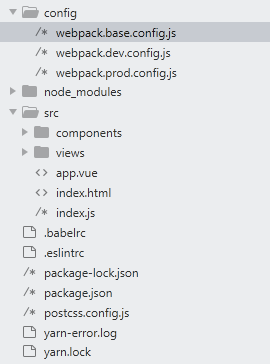

# webpack4配置vue和react

## 前言  
对于webpack4的一些概念和用法，可以查看我的[webpack4笔记](/pages/webpack/webpack)，写的算比较详细了，或者阅读[webpack官方文档](https://webpack.js.org)。所以这里只记录配置，没有记录相关的概念和用法。


## 配置vue项目  

### 构建项目目录  
首先通过`yarn init -y`初始化一个package.json,并创建好以下目录  
  

> config是配置目录，src是vue的目录。因为只是配置简单的veu项目，就没有添加router和store等相关的  

### 安装相关依赖   
#### webpack工具相关  
```
yarn add webpack webpack-cli webpack-dev-server webpack-merge friendly-errors-webpack-plugin happypack optimize-css-assets-webpack-plugin clean-webpack-plugin terser-webpack-plugin progress-bar-webpack-plugin -D
/*
	webpack-dev-server 用于开启http服务，并配置热更新
	webpack-merge 合并配置文件
	friendly-errors-webpack-plugin 用于输入错误
	happypack 多线程打包[大型项目使用多线程打包效果还是很可观的]
	terser-webpack-plugin //js压缩优化 替换掉uglifyjs-webpack-plugin解决uglifyjs不支持es6语法问题
	optimize-css-assets-webpack-plugin 压缩css
	clean-webpack-plugin 清除dist
	progress-bar-webpack-plugin 以进度条的形式输出打包日志
*/
```

#### css img html相关  
```
yarn add sass-loader node-sass css-loader style-loader mini-css-extract-plugin postcss-loader autoprefixer responsive-loader url-loader file-loader html-webpack-plugin jimp -D
/*
	css-loader style-loader 用于处理css
	postcss-loader 可以使用
	autoprefixer 通过postcss给浏览器不支持的css加前缀
	sass-loader node-sass 处理sass scss文件，因为我用的是这个，less换成less-loader即可
	mini-css-extract-plugin 提取项目中的css到一个单独的文件
	url-loader responsive-loader file-loader 处理图片，小于一定大小转成base64
	html-webpack-plugin 打包html
	jimp 处理图片的依赖，我配置时报这个错，安装完就好了
*/ 

```

#### js相关  
```
yarn add babel-loader @babel/core @babel/preset-env @babel/plugin-transform-runtime @babel/plugin-proposal-class-properties @babel/plugin-proposal-decorators 
@babel/plugin-syntax-dynamic-import -D

yarn add @babel/runtime @babel/polyfill
/*
	babel-loader @babel/preset-env @babel/core 处理js兼容
	@babel/plugin-transform-runtime @babel/runtime 避免重复引入辅助代码
	@babel/plugin-proposal-class-properties 添加对class支持
	@babel/plugin-proposal-decorators 装饰器支持
	@babel/plugin-syntax-dynamic-import 异步加载
	@babel/polyfill 给es6+实例方法添加补丁
*/
```


#### vue相关  
```
yarn add vue vue-loader vue-style-loader vue-template-compiler -D
yarn add vue
/*
	vue-loader vue-style-loader vue-template-compiler 处理vue文件
	vue vue框架
*/
```

#### eslint相关[这里未配置]  
```
yarn add eslint-loader eslint-config-standard eslint-plugin-vue -D
/*
	eslint-loader eslint-config-standard eslint-plugin-vue 对js vue进行语法检查，采用eslint-config-standard规范，不想要的可以忽略
*/
```


### 配置  

- 基础配置  

```
//webpack.base.config.js

const path = require('path')
const MiniCssExtractPlugin = require('mini-css-extract-plugin')
const VueLoaderPlugin = require('vue-loader/lib/plugin')
const HtmlWebpackPlugin = require('html-webpack-plugin')

module.exports = {
  entry: {
    main: './src/index.js'
  },
  output: {
    path: path.join(__dirname, '../dist'),
    // publicPath: '/',
    filename: 'js/[name].[hash:8].js',
    chunkFilename: 'js/[name].[chunkhash].js'
  },
  module: {
    rules: [
      {
        test: /\.css$/,
        // 记住loader的解析顺序是从后往前的
        use: [ 
          MiniCssExtractPlugin.loader,
          'css-loader', 
          'postcss-loader',
        ]
      },
      {
        test: /\.(sass|scss)/,
        use: [
          MiniCssExtractPlugin.loader,
          'css-loader', 
          'postcss-loader', 
          'sass-loader'
        ]
      },
      {
        test: /\.(png|jpg|gif)$/i,
        use: [
          {
            loader: 'url-loader',
            options: {
              fallback: 'responsive-loader',
              limit: 4096,
              quality: 50,
              name: '[name].[hash:8].[ext]',
              outputPath: 'img'
            }
          }
        ]
      },
      {
        test: /\.vue$/,
        use: ['vue-loader']
      },
      {
        test: /\.js$/,
        exclude: /node_modules/,
        use: ['babel-loader']
      }
    ]
  },
  // 配置别名
  resolve: {
    alias: {
      '@': path.resolve(__dirname, 'src'),
      '~': path.resolve(__dirname, 'src/assets')
    },
    // false可以不带扩展
    enforceExtension: false,
    // 自动解析确定的扩展
    extensions: ['.js', '.vue']
  },
  plugins: [
    new VueLoaderPlugin(),
    new MiniCssExtractPlugin({
      filename: 'css/[name].[contentHash:8].css'
    }),
    new HtmlWebpackPlugin({
      title: 'hello world',
      filename: 'index.html',
      template: './src/index.html',
      inject: true
    })
  ]
}
```
- 开发配置  

```
// webpack.dev.config.js

const webpack = require('webpack')
const path = require('path')
const baseConfig = require('./webpack.base.config')
const merge = require('webpack-merge')
const FriendlyErrorsWebpackPlugin = require('friendly-errors-webpack-plugin')

module.exports = merge(baseConfig, {
  mode: 'development',
  devServer: {
    contentBase: path.resolve(__dirname,'./dist'),
    host: 'localhost',
    port: 3003,
    hot: true,
    compress: true,
    noInfo: true,
    // 在浏览器显示错误和警告
    overlay: {
      warnings: true,
      errors: true
    },
    // 去除掉每次修改时，控制台的日志
    clientLogLevel: 'none'
  },
  plugins: [
    // 注入到webpack，添加环境变量
    new webpack.DefinePlugin({
      'DEV': JSON.stringify('development')
    }),
    new FriendlyErrorsWebpackPlugin({
      compilationSuccessInfo: {
        messages: ['项目成功启动，地址是localhost:8080']
      }
    })
  ]
})
```

- 生产配置  

```
//webpack.prod.config.js

const webpack = require('webpack')
const merge = require('webpack-merge')
const BaseConfig = require('./webpack.base.config')
const { CleanWebpackPlugin } = require('clean-webpack-plugin')
const TerserPlugin = require('terser-webpack-plugin')
const ProgressBarPlugin = require('progress-bar-webpack-plugin')
const OptimizationCssAssetsPlugin = require('optimize-css-assets-webpack-plugin')
const HtmlWebpackPlugin = require('html-webpack-plugin')

module.exports = merge(BaseConfig, {
  mode: 'production',
  optimization: {
    // 对代码进行代码分割，生成公共包
    splitChunks: {
      chunks: 'all',
      minSize: 0, // 生产块的最小大小
      maxSize: 0,
      name: true,
      cacheGroups: {
        commons: {
          name: 'commons',
          chunks: 'all',
          minChunks: 2
        }
      }
    },
    minimizer: [
      new TerserPlugin({
        sourceMap: false,
        terserOptions: {
          cache: true,
          compress: {
            drop_debugger: true,
            drop_console: true
          }
        }
      }),
      new OptimizationCssAssetsPlugin({
        assetNameRegExp: /\.css$/g,
        cssProcessor: require('cssnano')
      }),
    ]
  },
  stats: {
    modules: false,
    source: false
  },
  plugins: [
    new CleanWebpackPlugin(),
    new webpack.DefinePlugin({
      'DEV': JSON.stringify('production')
    }),
    new ProgressBarPlugin({
      callback: function (res) {
        console.log('打包成功，请在dist目录查看打包结果')
      }
    })
  ]
})
```

- 添加script命令  

```
//package.json
/*
    --open 打开浏览器
    --progress 显示进度
    --colors 区分颜色
    --config 需要运行的配置目录，默认webpack.config.js
    --hot 触发模块热更新
    --inline 触发热更新
    使用--hot和--inline可以实现模块热更新（当然，也可以是配置HotModuleReplacementPlugin）
*/
"scripts": {
  "dev": "webpack-dev-server --inline --hot --open --progress --colors --config config/webpack.dev.config.js",
  "build": "webpack --config config/webpack.prod.config.js",
  "test": "echo \"Error: no test specified\" && exit 1"
}

```

- .babelrc文件  

```
{
  "presets": [
    [
      "@babel/preset-env",
      {
      	"useBuiltIns": "usage",
        "targets": {
          "chrome": "58",
          "ie": "10"
        }
      },
    ]
  ],
  "plugins": [
  	["@babel/plugin-proposal-decorators", { "legacy": true }],
    ["@babel/plugin-proposal-class-properties", { "loose" : true }],
    "@babel/plugin-transform-runtime",
    "@babel/plugin-syntax-dynamic-import"
  ]
}

```

- postcss.config.js  

```
module.exports = {
	plugins: [
		require('autoprefixer')
	]
}
```

- package.json  

```
{
  "name": "webpack-vue-cli",
  "version": "1.0.0",
  "main": "index.js",
  "scripts": {
    "dev": "webpack-dev-server --inline --hot --open --progress --colors --config config/webpack.dev.config.js",
    "build": "webpack --config config/webpack.prod.config.js"
  },
  "license": "MIT",
  "devDependencies": {
    "@babel/core": "^7.6.2",
    "@babel/plugin-proposal-class-properties": "^7.5.5",
    "@babel/plugin-proposal-decorators": "^7.6.0",
    "@babel/plugin-syntax-dynamic-import": "^7.2.0",
    "@babel/plugin-transform-runtime": "^7.6.2",
    "@babel/preset-env": "^7.6.2",
    "autoprefixer": "^9.6.4",
    "babel-loader": "^8.0.6",
    "clean-webpack-plugin": "^3.0.0",
    "cross-env": "^6.0.3",
    "css-loader": "^3.2.0",
    "cssnano": "^4.1.10",
    "file-loader": "^4.2.0",
    "friendly-errors-webpack-plugin": "^1.7.0",
    "html-webpack-plugin": "^3.2.0",
    "jimp": "^0.8.4",
    "mini-css-extract-plugin": "^0.8.0",
    "node-sass": "^4.12.0",
    "optimize-css-assets-webpack-plugin": "^5.0.3",
    "postcss-loader": "^3.0.0",
    "progress-bar-webpack-plugin": "^1.12.1",
    "responsive-loader": "^1.2.0",
    "sass-loader": "^8.0.0",
    "style-loader": "^1.0.0",
    "terser-webpack-plugin": "^2.1.3",
    "uglifyjs-webpack-plugin": "^2.2.0",
    "url-loader": "^2.2.0",
    "vue-loader": "^15.7.1",
    "vue-style-loader": "^4.1.2",
    "vue-template-compiler": "^2.6.10",
    "webpack": "^4.41.0",
    "webpack-cli": "^3.3.9",
    "webpack-dev-server": "^3.8.2",
    "webpack-merge": "^4.2.2"
  },
  "dependencies": {
    "@babel/runtime": "^7.6.3",
    "vue": "^2.6.10"
  }
}

```


## 配置react项目

> 和前面的配置vue差不多，项目目录就和前面的一样，config文件夹写配置，src文件夹写react项目。这里就直接贴上配置，主要区别是react使用@babel/preset-react来处理jsx。可在github上直接pull下来然后npm install 安装依赖。  

- package.json

```
{
  "name": "webpack-react-cli",
  "version": "1.0.0",
  "main": "index.js",
  "license": "MIT",
  "scripts": {
    "dev": "webpack-dev-server --inline --hot --open --progress --colors --config config/webpack.dev.config.js",
    "build": "webpack --config config/webpack.prod.config.js"
  },
  "devDependencies": {
    "@babel/core": "^7.6.2",
    "@babel/plugin-proposal-class-properties": "^7.5.5",
    "@babel/plugin-proposal-decorators": "^7.6.0",
    "@babel/plugin-syntax-dynamic-import": "^7.2.0",
    "@babel/plugin-transform-runtime": "^7.6.2",
    "@babel/preset-env": "^7.6.2",
    "@babel/preset-react": "^7.6.3",
    "autoprefixer": "^9.6.4",
    "babel-loader": "^8.0.6",
    "clean-webpack-plugin": "^3.0.0",
    "cross-env": "^6.0.3",
    "css-loader": "^3.2.0",
    "cssnano": "^4.1.10",
    "file-loader": "^4.2.0",
    "friendly-errors-webpack-plugin": "^1.7.0",
    "html-webpack-plugin": "^3.2.0",
    "jimp": "^0.8.4",
    "mini-css-extract-plugin": "^0.8.0",
    "node-sass": "^4.12.0",
    "optimize-css-assets-webpack-plugin": "^5.0.3",
    "postcss-loader": "^3.0.0",
    "progress-bar-webpack-plugin": "^1.12.1",
    "responsive-loader": "^1.2.0",
    "sass-loader": "^8.0.0",
    "style-loader": "^1.0.0",
    "terser-webpack-plugin": "^2.1.3",
    "uglifyjs-webpack-plugin": "^2.2.0",
    "url-loader": "^2.2.0",
    "webpack": "^4.41.0",
    "webpack-cli": "^3.3.9",
    "webpack-dev-server": "^3.8.2",
    "webpack-merge": "^4.2.2"
  },
  "dependencies": {
    "@babel/polyfill": "^7.6.0",
    "@babel/runtime": "^7.6.3",
    "react": "^16.10.2",
    "react-dom": "^16.10.2"
  }
}
```


- webpack.base.config.js  

```
const path = require('path')
const MiniCssExtractPlugin = require('mini-css-extract-plugin')
const HtmlWebpackPlugin = require('html-webpack-plugin')

module.exports = {
  entry: {
    main: './src/index.js'
  },
  output: {
    path: path.join(__dirname, '../dist'),
    // publicPath: '/',
    filename: 'js/[name].[hash:8].js',
    chunkFilename: 'js/[name].[chunkhash].js'
  },
  module: {
    rules: [
      {
        test: /\.css$/,
        // 记住loader的解析顺序是从后往前的
        use: [ 
          MiniCssExtractPlugin.loader,
          'css-loader', 
          'postcss-loader',
        ]
      },
      {
        test: /\.(sass|scss)/,
        use: [
          MiniCssExtractPlugin.loader,
          'css-loader', 
          'postcss-loader', 
          'sass-loader'
        ]
      },
      {
        test: /\.(png|jpg|gif)$/i,
        use: [
          {
            loader: 'url-loader',
            options: {
              fallback: 'responsive-loader',
              limit: 4096,
              quality: 50,
              name: '[name].[hash:8].[ext]',
              outputPath: 'img'
            }
          }
        ]
      },
      {
        test: /\.js$/,
        exclude: /node_modules/,
        use: ['babel-loader']
      }
    ]
  },
  // 配置别名
  resolve: {
    alias: {
      '@': path.resolve(__dirname, 'src'),
      '~': path.resolve(__dirname, 'src/assets')
    },
    // false可以不带扩展
    enforceExtension: false,
    // 自动解析确定的扩展
    extensions: ['.js', '.jsx']
  },
  plugins: [
    new MiniCssExtractPlugin({
      filename: 'css/[name].[contentHash:8].css'
    }),
    new HtmlWebpackPlugin({
      title: 'hello world',
      filename: 'index.html',
      template: './src/index.html',
      inject: true
    })
  ]
}
```

- webpack.dev.config.js  

```
const webpack = require('webpack')
const path = require('path')
const baseConfig = require('./webpack.base.config')
const merge = require('webpack-merge')
const FriendlyErrorsWebpackPlugin = require('friendly-errors-webpack-plugin')

module.exports = merge(baseConfig, {
  mode: 'development',
  devServer: {
    contentBase: path.resolve(__dirname,'./dist'),
    host: 'localhost',
    port: 3030,
    hot: true,
    compress: true,
    noInfo: true,
    // 在浏览器显示错误和警告
    overlay: {
      warnings: true,
      errors: true
    },
    // 去除掉每次修改时，控制台的日志
    clientLogLevel: 'none'
  },
  plugins: [
    // 注入到webpack，添加环境变量
    new webpack.DefinePlugin({
      'DEV': JSON.stringify('development')
    }),
    new FriendlyErrorsWebpackPlugin({
      compilationSuccessInfo: {
        messages: ['项目成功启动，地址是localhost:3030']
      }
    })
  ]
})
```

- webpack.prod.config.js  

```
const webpack = require('webpack')
const merge = require('webpack-merge')
const BaseConfig = require('./webpack.base.config')
const { CleanWebpackPlugin } = require('clean-webpack-plugin')
const TerserPlugin = require('terser-webpack-plugin')
const ProgressBarPlugin = require('progress-bar-webpack-plugin')
const OptimizationCssAssetsPlugin = require('optimize-css-assets-webpack-plugin')
const HtmlWebpackPlugin = require('html-webpack-plugin')

module.exports = merge(BaseConfig, {
  mode: 'production',
  optimization: {
    // 对代码进行代码分割，生成公共包
    splitChunks: {
      chunks: 'all',
      minSize: 0, // 生产块的最小大小
      maxSize: 0,
      name: true,
      cacheGroups: {
        commons: {
          name: 'commons',
          chunks: 'all',
          minChunks: 2
        }
      }
    },
    minimizer: [
      new TerserPlugin({
        sourceMap: false,
        terserOptions: {
          cache: true,
          compress: {
            drop_debugger: true,
            drop_console: true
          }
        }
      }),
      new OptimizationCssAssetsPlugin({
        assetNameRegExp: /\.css$/g,
        cssProcessor: require('cssnano')
      }),
    ]
  },
  stats: {
    modules: false,
    source: false
  },
  plugins: [
    new CleanWebpackPlugin(),
    new webpack.DefinePlugin({
      'DEV': JSON.stringify('production')
    }),
    new ProgressBarPlugin({
      callback: function (res) {
        console.log('打包成功，请在dist目录查看打包结果')
      }
    })
  ]
})
```

- .babelrc  

```
{
  "presets": [
    [
      "@babel/preset-env",
      {
      	"useBuiltIns": "usage",
        "targets": {
          "chrome": "58",
          "ie": "10"
        }
      }
    ],
    "@babel/preset-react"
  ],
  "plugins": [
  	["@babel/plugin-proposal-decorators", { "legacy": true }],
    ["@babel/plugin-proposal-class-properties", { "loose" : true }],
    "@babel/plugin-transform-runtime",
    "@babel/plugin-syntax-dynamic-import"
  ]
}
```

- postcss.config.js  

```
module.exports = {
  plugins: [
      require('autoprefixer')
  ]
}
```
